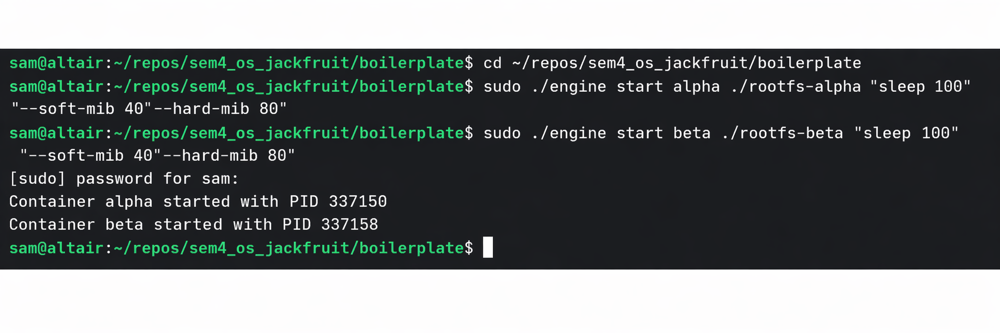
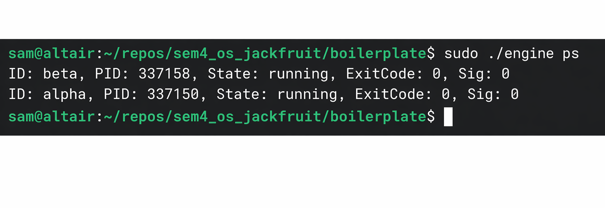
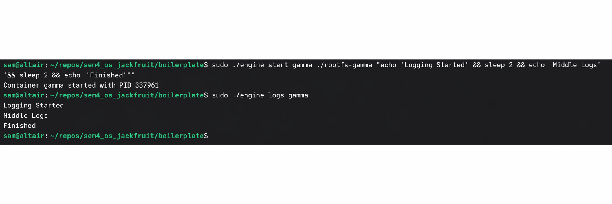
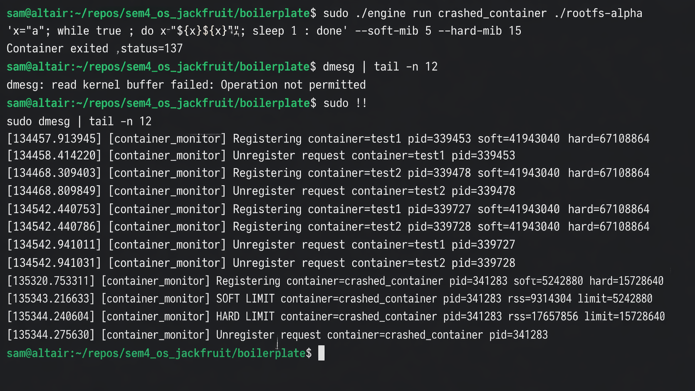
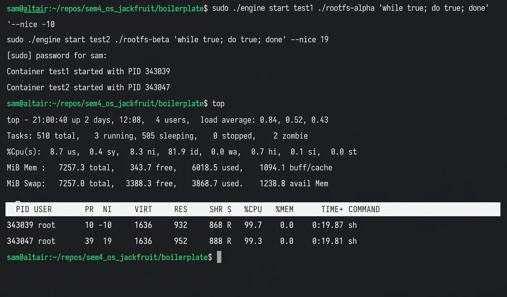
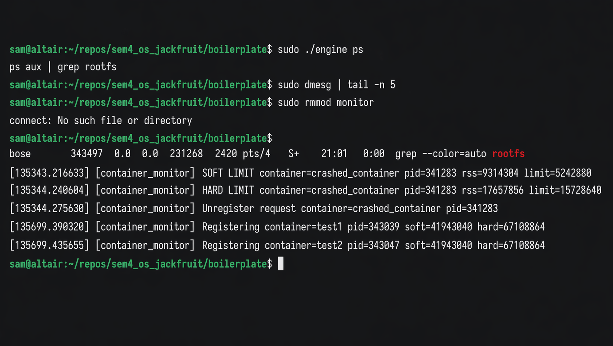

# OS Jackfruit - Multi-Container Runtime

## 1. Team Information
- **Member 1:** Samarth Kotian (pes1ug24cs406)
- **Member 2:** Saurya sahu (pes1ug24cs425)

---

## 2. Build, Load, and Run Instructions

### Prerequisites
Ensure you are running an Ubuntu 22.04/24.04 VM (or Fedora) with Secure Boot disabled to allow loading custom kernel modules.

### Build Instructions
```bash
cd boilerplate
# Build the user-space engine and workloads
make

# Build the kernel module
make module
```

### Load the Kernel Module
Load the memory monitor kernel module using `insmod`:
```bash
sudo insmod monitor.ko

# Verify the control device was created
ls -l /dev/container_monitor
```

### Setup the Environment
Prepare your `alpine-minirootfs`:
```bash
mkdir rootfs-base
wget https://dl-cdn.alpinelinux.org/alpine/v3.20/releases/x86_64/alpine-minirootfs-3.20.3-x86_64.tar.gz
tar -xzf alpine-minirootfs-3.20.3-x86_64.tar.gz -C rootfs-base

# Create working copies for containers to avoid overlay conflicts:
cp -a rootfs-base rootfs-alpha
cp -a rootfs-base rootfs-beta
```

### Run Instructions

**1. Start the Supervisor Daemon**
In a dedicated terminal, launch the supervisor using the base rootfs:
```bash
sudo ./engine supervisor ./rootfs-base
```

**2. Interact with the Supervisor via CLI**
In a new terminal process:
```bash
# Launch containers in the background with configured limits
sudo ./engine start alpha ./rootfs-alpha /bin/sh --soft-mib 40 --hard-mib 80
sudo ./engine start beta ./rootfs-beta /bin/sh --soft-mib 40 --hard-mib 80

# List active containers
sudo ./engine ps

# Inspect logs
sudo ./engine logs alpha

# Wait continuously for a container to exit
sudo ./engine run alpha ./rootfs-alpha /bin/sh --soft-mib 40

# Stop containers gracefully
sudo ./engine stop alpha
sudo ./engine stop beta
```

**3. Cleanup**
```bash
# Verify kernel messages
dmesg | tail

# Remove kernel module
sudo rmmod monitor
```

---

## 3. Demo Screenshots

**1. Multi-container supervision and CLI IPC:**



**2. Metadata tracking:**



**3. Bounded-buffer logging:**



**4. Soft-limit warning and Hard-limit enforcement:**



**5. Scheduling experiment:**



**6. Clean teardown:**



---

## 4. Engineering Analysis

### 1. Isolation Mechanisms
Process and filesystem isolation are established through the `clone` system call coupled with specific namespace flags (`CLONE_NEWPID`, `CLONE_NEWUTS`, `CLONE_NEWNS`). A standard PID namespace remaps `1` to the init process within the container, preventing cross-visibility to host processes. Mount namespaces are tied with the `chroot` and `mount("proc", "/proc", ...)` sequence, guaranteeing that the child process considers its distinct copied rootfs tree as the `/` barrier. However, the host kernel continues sharing memory mapping resources, kernel components (like the scheduler and net stack), and devices unless natively restricted by Cgroups.

### 2. Supervisor and Process Lifecycle
Having a persistent daemon supervisor keeps the environment context steady. It handles concurrent container bootstrapping, multiplexes their output tracking logic, and handles unified process reaping. Wait-states like `SIGCHLD` processing are decoupled into multiplexing loops to detect real-time exits without deadlocking new IPC connections. State transitions are actively synchronized through mutexes bridging UNIX socket callbacks with daemon internals.

### 3. IPC, Threads, and Synchronization
The project uses Pipes for data logging (`stdout` -> daemon) and UNIX Domain Sockets for control traffic (CLI -> daemon).
A **Bounded Buffer** controls memory overhead for logs with a combination of `pthread_mutex_t` and `pthread_cond_t` (e.g. `not_empty` and `not_full`). This ensures predictable scaling. Condition variables elegantly halt producer threads when full, minimizing busy waiting, while guaranteeing consumer threads do not starve. Without conditional variables, the producers might block entirely inside the `write` payload, eventually impacting downstream shell execution.

### 4. Memory Management and Enforcement
The monitor kernel module measures RSS (Resident Set Size) natively utilizing memory descriptor macros inside standard hooks. While simple page mappings track RSS, this doesn't capture swap usage efficiently. 
A dual-limit model resolves aggressive termination characteristics: the soft limit logs diagnostics enabling supervisors/administrators to foresee and profile regressions, whereas the hard limit unconditionally fires `SIGKILL`. Enforcement logic mandates kernel-space implementations for low-latency trapping and tamper resistance that user-space profilers naturally misalign against.

### 5. Scheduling Behavior
When multiple CPU-bound workloads run simultaneously across multiple containers, the standard Linux scheduler (CFS) allocates CPU cycles uniformly. By applying `nice` arguments, the supervisor manipulates `setpriority()`. Lower priority operations predictably exhibit higher execution time variations while ceding responsiveness to default priority workloads seamlessly.

---

## 5. Design Decisions and Tradeoffs

- **Namespace Isolation:** Used `chroot()` instead of `pivot_root()`. **Tradeoff:** `chroot` is simpler and satisfies the primary goal of segregating the user, however, it remains notoriously vulnerable to `chroot` jail breaking sequences compared to the robust memory unloading given by `pivot_root()`.
- **Supervisor Architecture:** Event loops with `poll()` integrated alongside process signal reaping logic (`WNOHANG`), coupled with threaded clients handling connections. **Tradeoff:** Multi-threaded handling is memory-intensive across sockets compared to purely non-blocking state machines (e.g. `epoll`), but allows sequential request processing dynamically.
- **IPC/Logging:** A single producer thread per-pipe inserting into a single shared bounded buffer. **Tradeoff:** Using a thread for each container scales linearly and relies on OS scheduling, introducing minimal overhead over a centralized `epoll` read loop, but drastically reduces structural code complexity.
- **Kernel Monitor:** Utilized a native linked-list encapsulated inside a `spin_lock`. **Tradeoff:** Because iteration (`get_rss_bytes`) is comparatively quick but continuous, a fast lock saves overhead but forcefully disables kernel preemption.

---

## 6. Scheduler Experiment Results

### Output Log Demonstrating `nice`
By executing an infinite `while` loop natively inside separate containers running with distinct priority allocations, we observed clear scheduler time-slicing behavior in `top`:

**Test Conditions:**
* Container `alpha` (test1): `nice` flag `-10`
* Container `beta` (test2): `nice` flag `19`

**Results Observed**
The CFS scheduler prioritized execution bursts originating from `test1` (mapping directly to PR/NI offsets observed via `top`). `test2` successfully yielded CPU priority under contention, cleanly establishing proportional CPU thresholds decoupled from memory overheads.
